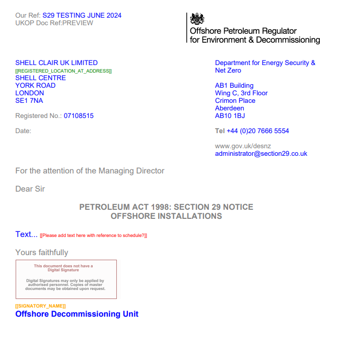
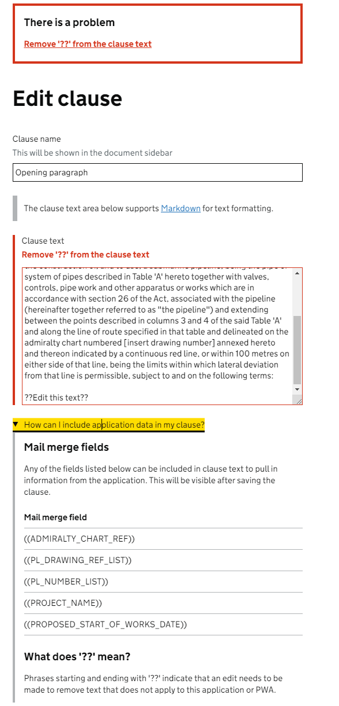

# Enforcing custom edits

* Status: proposed
* Deciders: jbarnett, hdevane
* Date: 2024-09-04

Technical Story: [S29-361](https://fivium.atlassian.net/browse/S29-361) <!-- optional -->

## Context and Problem Statement

In some document templates, there will be a need for the user preparing the document to enter in custom text, such as specific instructions that cannot be taken 
from the linked application. This concept is used across the Energy Portal in services such as Section 29 and PWA. 

### Background: how did it work in FOX?
In FOX, this would be handled by having an invalid mail merge field which will essentially instruct the user to enter the required details. If this invalid mail 
merge field was left in, then the document would not be able to fully generate (it could still be generated for the document preview).
Note that in FOX there was no validation on the mail merge fields that were added to a document template, unlike in the Digital Document Library.  




## Considered options 

1. A special defined mail merge field, CUSTOM_TEXT
2. Add delimiter condition for custom text
3. Temporary custom mail merge fields scoped to the document

### Option 1 - a special defined mail merge field, CUSTOM_TEXT

In this option, there would be a mail merge field that follows the standard functionality provided at the moment where the consuming service adds in the 
`CUSTOM_TEXT` mail merge field. 

````java
@Order(DocumentMailMergeFieldDisplayOrders.CUSTOM_TEXT)
@Component
public class CustomTextMailMergeField implements DocumentMailMergeField {

  static final String MNEMONIC = "CUSTOM_TEXT";
  static final String DESCRIPTION = "Enter custom text for this specific document";
  
  @Override
  public String getMnemonic() {
    return MNEMONIC;
  }

  @Override
  public String getDescription() {
    return DESCRIPTION;
  }

  @Override
  public boolean isApplicable(DocumentTemplateDto documentTemplateDto) {
    return true;
  }

  @Override
  public DocumentMailMergeFieldResolveResult resolve(DocumentInstanceDto documentInstanceDto) {
    return DocumentMailMergeFieldResolveResult.error("This mail merge field should be replaced with custom text");
  }
}
````

#### Pros 
- This would work with the digital document library as it is   
- It would allow users to save changes to the document template with no errors 
- It would prevent the users from fully generating the document, but it would also allow them to save changes to the document instance in chunks rather than having it update it all in one go

#### Cons
- This would rely on each consuming service to implement the mail merge field in this style 
  - There is no guarantee that every service would have this consistently named 
- This would act differently from the other document generation in the new services (PWA)
- It could be confusing for the customers who have learnt that the mail merge field means that the content will be handled for them, as this one mail merge field will be treated differently


### Option 2 - Add delimiter condition for custom text

In PWA, there are two mail merge types `AUTOMATIC` and `MANUAL`. The `AUTOMATIC` mail merge fields are the same as what is currently being used in the digital document library, where the values are 
resolved from the application linked to the document instance. The `MANUAL` mail merge field uses `??` instead of `((` as the wrapper for the mail merge field. The content of the `MANUAL` mail merge field 
is not resolved in PWA, when validating the document the presence of the `??` is checked and there will be an error if it is found.

If this option is chosen, it would need to be implemented differently as the functionality is not actually anything to do with mail merging. The `??` delimiter would be checked for in the `DocumentInstanceSectionFormValidator`, so 
that it would enforce that the required edits are made before the document instance is saved. Note that this would not be validated within the document template, so that it would be possible for administrator users to 
make changes to the document template with this delimiter included. 



#### Pros 
- The difference in the formatting (compared to using a standard mail merge field) should be clearer to the user that they need to make a change to the document section
- This doesn't require a static placeholder text to be added in the consuming services, the document templates would just contain the instructions wrapped in `??`.  
- Consistent appearance/functionality with other Energy Portal services (PWA)
- Adding in this change as described above will provide the functionality to existing consumer services with minimal changes required on their screen (just some additional screen guidance)

#### Cons 
- Whilst this is an existing concept in PWA, the implementation would be different and developers would need to be aware of the differences when working in the area


### Option 3 - Temporary custom mail merge fields scoped to the document

For a scenario where the user might be required to make a custom edit in the document in multiple places, this option would provide a way for the user to provide that information once, and then it is mail merged into the 
defined places. So it would essentially let the users define their own temporary mail merge fields.  

This information would be best suited to be stored outside the digital document library, so a new pattern should be developed to make sure we implement this in a consistent way across the consuming services.

#### Pros 
- Provides extra flexibility to the users, by allowing custom mail merge fields to be defined per document on the fly we would reduce the need for a change request
- Saves the customer time by bulk merging in custom data 

#### Cons 
- There is currently not a business need for this, but it is worth noting down in case there is a need in the future.  
  - Note with Section 29 there is one document per company, but multiple companies in a transaction. So in the scenario of needing to apply multiple custom edits, it would be better to store that information on the transaction, 
  so it can be reused across all the company letters
- This option is more complex than the other two options, and would require more technical discussion about the approach

## Decision 

Option 2, as it provides the required behaviour in the most user-friendly way whilst having the additional benefit of being consistent with existing Energy Portal services


